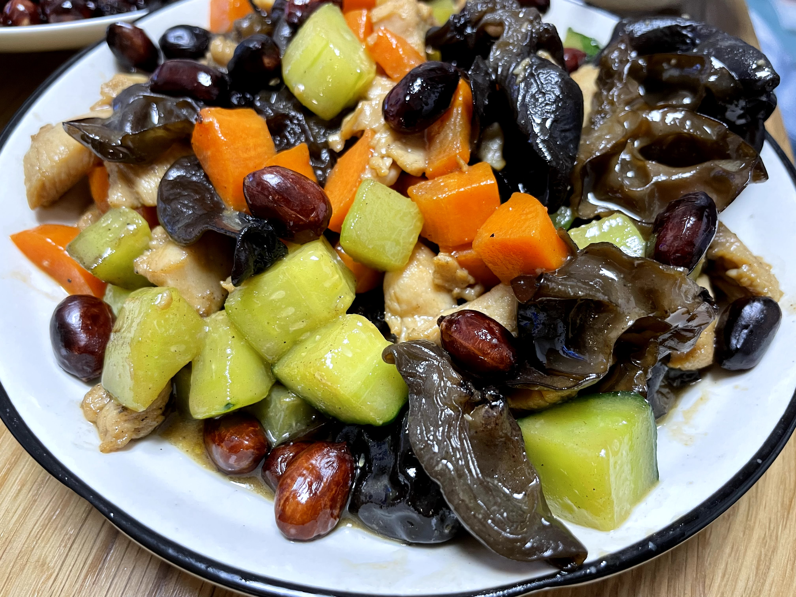
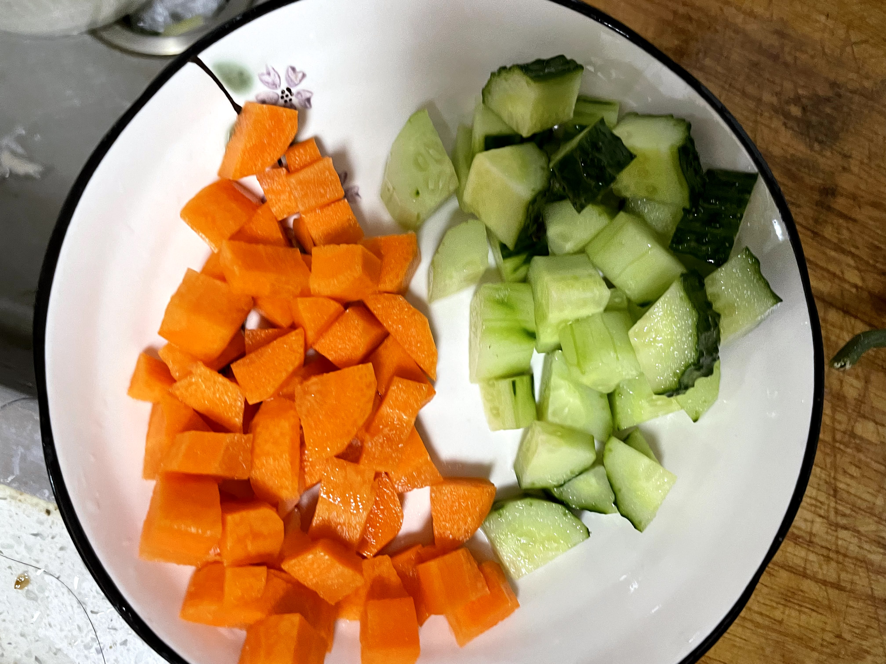

**食材:**
鸡胸肉，黄瓜丁，胡萝卜丁，花生米，黑木耳

**准备：**
- 鸡胸肉腌制，葱姜，生抽，耗油
- 胡萝卜丁焯水
- 黑木耳泡发
- 调酱汁（白糖，鸡精，盐，生抽，胡椒粉，淀粉，适量水)

**步骤：**
1. 热锅宽油，下鸡丁
2. 大火翻炒30s，起锅
3. 锅留底油，下黄瓜丁，胡萝卜丁，黑木耳
4. 炒至断生，下入鸡丁，翻炒30s
5. 倒入酱汁，大火收汁

**心得**
- 鸡丁要腌制入味

