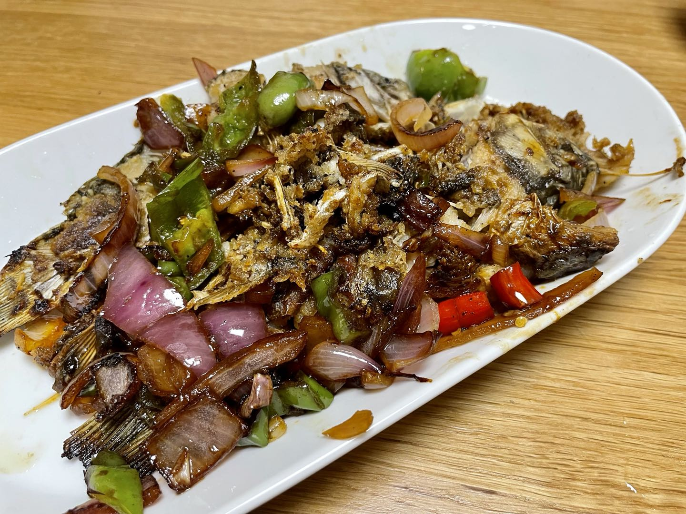

**食材:**
鲫鱼，洋葱，青椒，小米椒

**准备：**
- 鲫鱼洗净，两边改花刀，抹上少许盐
- 洋葱，青椒切小粒

**步骤：**
1. 热锅凉油
2. 中火
3. 下入鲫鱼，煎至两面焦黄
4. 盛出备用
5. 锅中加入少许油，倒入洋葱青椒小米椒，炒熟
6. 再放入煎好的鲫鱼
7. 放入少许盐，倒入适量生抽，拌均匀
8. 沿锅边淋入香醋，起锅装盘

**心得**
- 煎鱼的时候小心，别粘锅