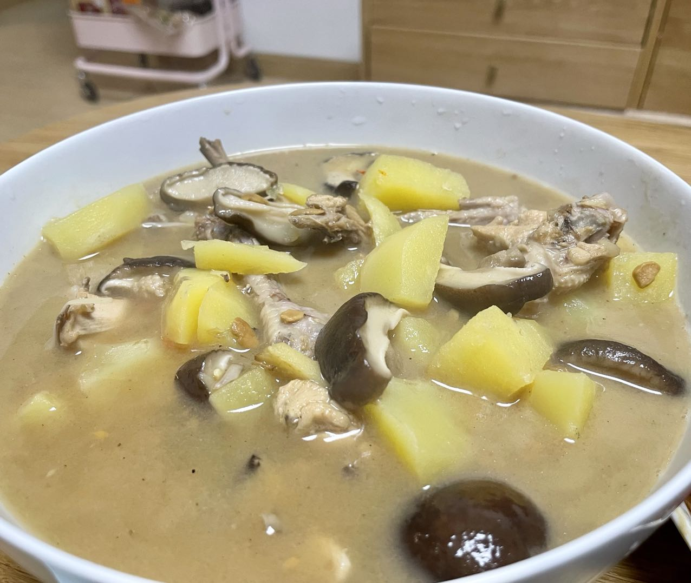

**食材:**
三黄鸡，土豆，香菇，金针菇，小米辣

**准备：**
- 鸡剁小块
- 香菇每朵分四块
- 土豆切丁
- 鸡块焯水

**步骤：**
1. 鸡块焯水去腥
2. 锅中加入油，倒入姜片，小米辣，鸡块，煸炒
3. 倒入开水，没过鸡块
4. 一大勺黄豆酱，少许蚝油，适量盐
5. 放入香菇，金针菇
6. 高压锅，煮25分钟
7. 再倒入土豆
8. 等土豆熟，调味出锅

**心得**
- 鸡块一定得焯水
- 黄焖鸡少不了香菇和黄豆酱

